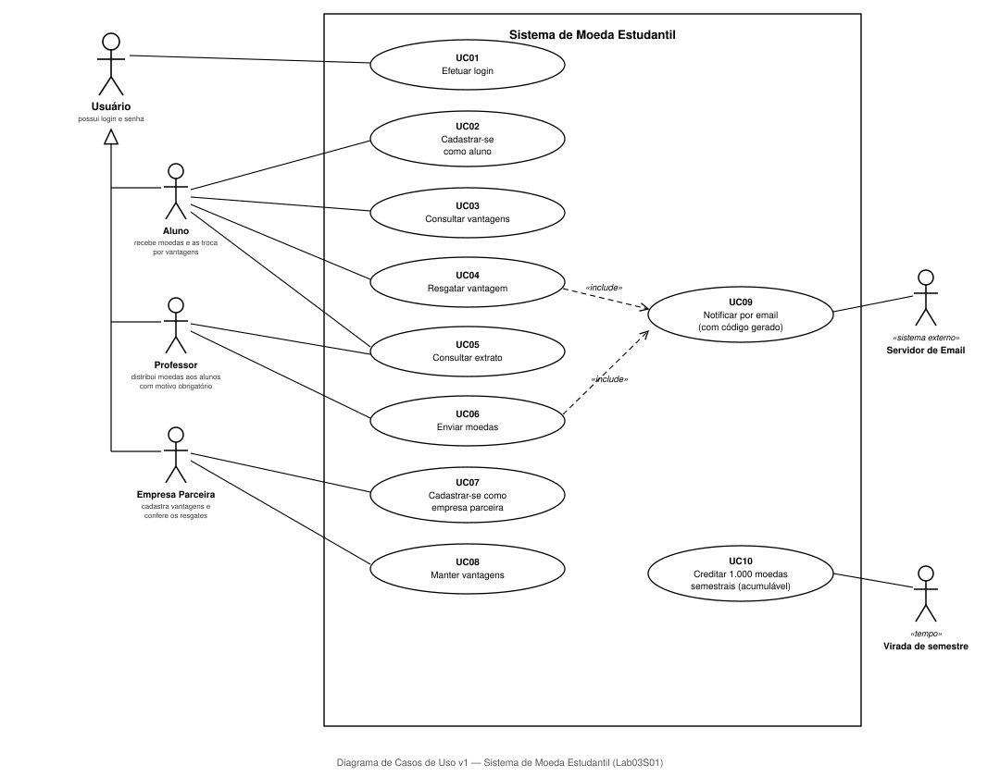
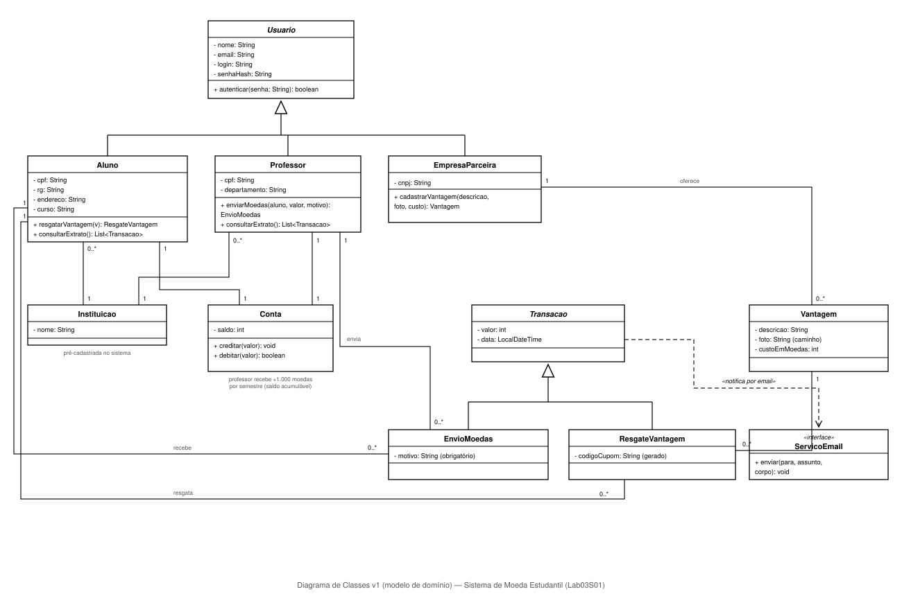
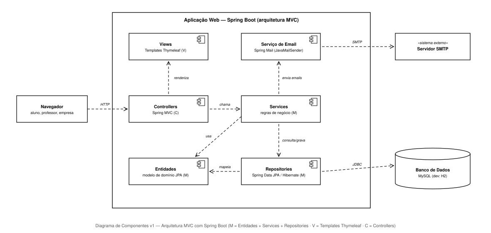

# Sistema de Moeda Estudantil

> Laboratório de Desenvolvimento de Software · Engenharia de Software · PUC Minas · 2º semestre/2026
> Prof. Glender Brás — **Laboratório 3: Sistema de Moeda Estudantil** (20 pontos)
> Aluno: Lucas Aguiar

Sistema para estimular o reconhecimento do mérito estudantil por meio de uma **moeda virtual**: professores recebem 1.000 moedas por semestre (acumuláveis) e as distribuem aos alunos como reconhecimento, sempre com um motivo; os alunos trocam as moedas por **vantagens** (descontos e produtos) cadastradas por **empresas parceiras**. Cada troca gera um **cupom com código**, enviado por email ao aluno e ao parceiro para conferência presencial.

## Sumário

- [Status das sprints](#status-das-sprints)
- [Modelagem do sistema (Lab03S01)](#modelagem-do-sistema-lab03s01)
  - [Atores](#atores)
  - [Regras de negócio](#regras-de-negócio)
  - [Requisitos funcionais](#requisitos-funcionais)
  - [Requisitos não funcionais](#requisitos-não-funcionais)
  - [Diagrama de casos de uso](#diagrama-de-casos-de-uso)
  - [Histórias de usuário](#histórias-de-usuário)
  - [Diagrama de classes](#diagrama-de-classes)
  - [Diagrama de componentes](#diagrama-de-componentes)
- [Tecnologias escolhidas](#tecnologias-escolhidas)

## Status das sprints

### 🔄 Lab03S01 — Modelagem do sistema
- [x] Diagrama de casos de uso ([`docs/diagrama-casos-de-uso-v1.svg`](docs/diagrama-casos-de-uso-v1.svg))
- [x] Histórias de usuário (neste README)
- [x] Diagrama de classes ([`docs/diagrama-classes-v1.svg`](docs/diagrama-classes-v1.svg))
- [x] Diagrama de componentes ([`docs/diagrama-componentes-v1.svg`](docs/diagrama-componentes-v1.svg))
- [ ] URL do repositório enviada no Canvas

### ⏳ Lab03S02 — Banco de dados e CRUDs (versão inicial)
- [ ] Modelo ER
- [ ] Estratégia de acesso ao banco (ORM com Spring Data JPA/Hibernate)
- [ ] CRUD de aluno e de empresa parceira (front-end + comunicação com back-end)

### ⏳ Lab03S03 — Versão final e apresentações
- [ ] CRUDs de aluno e empresa parceira (versão final)
- [ ] Apresentação da arquitetura e da camada de persistência (slides)
- [ ] Tutorial das tecnologias (salão de tecnologias, 20 min)

---

# Modelagem do sistema (Lab03S01)

## Atores

| Ator | Descrição |
|---|---|
| **Usuário** | Ator geral: todo usuário possui login e senha e precisa se autenticar para usar o sistema. Aluno, Professor e Empresa Parceira são especializações dele. |
| **Aluno** | Cadastra-se no sistema (nome, email, CPF, RG, endereço, instituição e curso), recebe moedas dos professores, consulta extrato e troca moedas por vantagens. |
| **Professor** | Pré-cadastrado pela instituição (nome, CPF, departamento, instituição). Distribui moedas aos alunos com uma mensagem de motivo e consulta seu extrato. |
| **Empresa Parceira** | Cadastra-se no sistema e mantém as vantagens que oferece (descrição, foto e custo em moedas); recebe email de conferência a cada resgate. |
| **Servidor de Email** | Sistema externo: envia as notificações de recebimento de moedas e os cupons de resgate (aluno e parceiro), com código gerado pelo sistema. |
| **Virada de semestre** | Ator de tempo: a cada semestre dispara o crédito de 1.000 moedas no saldo de cada professor. |

## Regras de negócio

| ID | Regra |
|---|---|
| RN01 | Cada professor recebe **1.000 moedas por semestre**; o saldo é **acumulável** entre semestres. |
| RN02 | Para enviar moedas o professor precisa de **saldo suficiente** e deve indicar o **aluno** e o **motivo** do reconhecimento (mensagem aberta, obrigatória). |
| RN03 | Ao receber moedas, o aluno é **notificado por email**. |
| RN04 | O resgate de uma vantagem **debita o custo** do saldo do aluno (exige saldo suficiente). |
| RN05 | Todo resgate gera um **código de cupom** enviado por email ao **aluno** (para a troca presencial) e ao **parceiro** (para conferência). |
| RN06 | Toda vantagem tem **descrição, foto e custo em moedas**. |
| RN07 | As **instituições são pré-cadastradas** (o aluno apenas seleciona a sua) e os **professores são pré-cadastrados** a partir da lista enviada pela instituição, com vínculo explícito a ela. |
| RN08 | Todas as operações exigem **autenticação** por login e senha. |

## Requisitos funcionais

| ID | Requisito | Prioridade |
|---|---|---|
| RF01 | Autenticar alunos, professores e empresas parceiras por login e senha. | Alta |
| RF02 | Permitir o cadastro de aluno com nome, email, CPF, RG, endereço, **instituição (selecionada entre as pré-cadastradas)** e curso. | Alta |
| RF03 | Permitir o cadastro de empresa parceira. | Alta |
| RF04 | Permitir que o professor envie moedas a um aluno, validando saldo e exigindo o motivo (RN02). | Alta |
| RF05 | Notificar o aluno por email ao receber moedas (RN03). | Alta |
| RF06 | Exibir o extrato do professor: saldo atual e envios realizados. | Alta |
| RF07 | Exibir o extrato do aluno: saldo atual, recebimentos e trocas. | Alta |
| RF08 | Exibir ao aluno as vantagens cadastradas (descrição, foto e custo). | Alta |
| RF09 | Permitir o resgate de vantagem: debitar o saldo, gerar código e enviar os emails de cupom ao aluno e ao parceiro (RN04, RN05). | Alta |
| RF10 | Permitir que a empresa parceira cadastre, altere e remova suas vantagens (descrição, foto, custo). | Alta |
| RF11 | Creditar automaticamente 1.000 moedas ao saldo de cada professor a cada semestre (RN01). | Alta |
| RF12 | Manter professores e instituições pré-cadastrados (carga inicial do sistema). | Média |

## Requisitos não funcionais

| ID | Requisito | Categoria |
|---|---|---|
| RNF01 | O sistema deve usar **arquitetura MVC** (exigência do enunciado). | Arquitetura |
| RNF02 | Back-end em **Java com Spring Boot**; views com **Thymeleaf**. | Implementação |
| RNF03 | Persistência em banco relacional via **ORM** (Spring Data JPA/Hibernate); MySQL em produção e H2 em desenvolvimento. | Persistência |
| RNF04 | Senhas armazenadas com **hash** (BCrypt), nunca em texto puro. | Segurança |
| RNF05 | Cada papel acessa apenas as suas funções (aluno não envia moedas, professor não cadastra vantagens etc.). | Segurança |
| RNF06 | Os modelos UML devem ser versionados no repositório (`-v1`, `-v2`, ...), refletindo as correções de cada sprint. | Processo |
| RNF07 | Interface web responsiva e amigável. | Usabilidade |

## Diagrama de casos de uso

O ator **Usuário** é o ator geral ("pai"): Aluno, Professor e Empresa Parceira herdam o login. O **Servidor de Email** é um sistema externo acionado pelas notificações (UC09, incluído pelo envio de moedas e pelo resgate). A **virada de semestre** é um ator de tempo que dispara o crédito semestral (UC10).

| Caso de uso | Ator principal | Resumo |
|---|---|---|
| UC01 Efetuar login | Usuário | Autenticação por login e senha (RF01, RN08). |
| UC02 Cadastrar-se como aluno | Aluno | Cadastro com instituição selecionada entre as pré-cadastradas (RF02, RN07). |
| UC03 Consultar vantagens | Aluno | Lista as vantagens com descrição, foto e custo (RF08). |
| UC04 Resgatar vantagem | Aluno | Debita o saldo, gera o código e dispara os emails de cupom (RF09, RN04, RN05). Inclui UC09. |
| UC05 Consultar extrato | Aluno, Professor | Saldo e transações realizadas (RF06, RF07). |
| UC06 Enviar moedas | Professor | Envio com validação de saldo e motivo obrigatório (RF04, RN02). Inclui UC09. |
| UC07 Cadastrar-se como empresa parceira | Empresa Parceira | Cadastro da empresa (RF03). |
| UC08 Manter vantagens | Empresa Parceira | CRUD das vantagens oferecidas (RF10, RN06). |
| UC09 Notificar por email | Servidor de Email | Envio das notificações e cupons com código gerado (RF05, RN03, RN05). |
| UC10 Creditar 1.000 moedas semestrais | Virada de semestre | Crédito automático e acumulável no saldo dos professores (RF11, RN01). |

## Histórias de usuário

**HU01** — Como **usuário** (aluno, professor ou empresa), quero acessar o sistema com login e senha, para que apenas pessoas autorizadas usem as funções do meu papel.
*Critérios de aceite:* credenciais válidas levam ao painel do papel correto; inválidas são recusadas com aviso.

**HU02** — Como **aluno**, quero me cadastrar informando nome, email, CPF, RG, endereço, instituição e curso, para participar do sistema de mérito.
*Critérios de aceite:* a instituição é selecionada de uma lista pré-cadastrada; todos os campos são obrigatórios e validados; CPF/email não podem se repetir.

**HU03** — Como **empresa**, quero me cadastrar como parceira, para oferecer vantagens aos alunos.
*Critérios de aceite:* cadastro com dados da empresa e credenciais de acesso.

**HU04** — Como **professor**, quero enviar moedas a um aluno informando o motivo, para reconhecer seu mérito.
*Critérios de aceite:* o envio só ocorre com saldo suficiente; o motivo é obrigatório; o valor é debitado do professor e creditado ao aluno.

**HU05** — Como **aluno**, quero ser notificado por email ao receber moedas, para saber do reconhecimento.
*Critérios de aceite:* o email informa o professor, o valor e o motivo.

**HU06** — Como **professor**, quero consultar meu extrato, para acompanhar meu saldo e os envios que fiz.
*Critérios de aceite:* mostra o saldo atual e a lista de envios (aluno, valor, motivo, data).

**HU07** — Como **aluno**, quero consultar meu extrato, para acompanhar meu saldo, recebimentos e trocas.
*Critérios de aceite:* mostra o saldo atual e as transações (recebimentos e resgates) com data.

**HU08** — Como **empresa parceira**, quero cadastrar vantagens com descrição, foto e custo em moedas, para atrair os alunos.
*Critérios de aceite:* descrição, foto e custo são obrigatórios; a vantagem fica visível aos alunos.

**HU09** — Como **aluno**, quero consultar as vantagens disponíveis, para decidir como usar minhas moedas.
*Critérios de aceite:* lista com descrição, foto, custo e empresa.

**HU10** — Como **aluno**, quero resgatar uma vantagem, para trocar minhas moedas por produtos e descontos.
*Critérios de aceite:* o custo é debitado do meu saldo (bloqueado se insuficiente); recebo por email um cupom com código; o parceiro recebe email com o mesmo código para conferência.

**HU11** — Como **professor**, quero receber 1.000 moedas a cada semestre, acumulando com o saldo que já tenho, para continuar reconhecendo meus alunos.
*Critérios de aceite:* na virada do semestre o saldo aumenta em exatamente 1.000, sem zerar o restante.

**HU12** — Como **empresa parceira**, quero receber um email com o código de cada resgate, para conferir a troca presencial.
*Critérios de aceite:* o email chega no momento do resgate e o código confere com o do cupom do aluno.

## Diagrama de classes

Modelo de domínio (as camadas MVC aparecem no diagrama de componentes):

Decisões de modelagem:

- **`Usuario`** é abstrata (nome, email, login, senha com hash) e concentra a autenticação (RN08); `Aluno`, `Professor` e `EmpresaParceira` herdam dela — espelhando a generalização de atores.
- **`Conta`** guarda o saldo de moedas, com `creditar`/`debitar`; `Aluno` e `Professor` têm uma conta cada. O crédito semestral (RN01) credita 1.000 na conta do professor, acumulando.
- **`Transacao`** é abstrata (valor, data) e forma o extrato; especializa-se em **`EnvioMoedas`** (com o motivo obrigatório, RN02) e **`ResgateVantagem`** (com o código do cupom, RN05).
- **`Vantagem`** (descrição, foto, custo) pertence a uma **`EmpresaParceira`** (RN06).
- **`Instituicao`** é pré-cadastrada e associada a alunos e professores (RN07).
- **`ServicoEmail`** é uma interface: as transações disparam notificações por email através dela (RN03, RN05) — na implementação, via Spring Mail.

## Diagrama de componentes

Arquitetura **MVC com Spring Boot** (exigência do enunciado):

- **View** — templates **Thymeleaf** renderizados no servidor (telas de cadastro, extrato, vantagens, envio de moedas);
- **Controller** — controllers **Spring MVC** recebem as requisições HTTP do navegador, chamam os services e escolhem a view;
- **Model** — **entidades JPA** (o modelo de domínio do diagrama de classes), **services** com as regras de negócio (RN01-RN08) e **repositories** Spring Data JPA que fazem o acesso ao banco via ORM (Hibernate);
- O **Serviço de Email** (Spring Mail) fala com um servidor SMTP externo; o banco é **MySQL** (H2 em desenvolvimento).

## Tecnologias escolhidas

| Tecnologia | Papel no sistema | Por quê |
|---|---|---|
| **Java 21 + Spring Boot 3** | Back-end e arcabouço MVC | Continuidade do Java usado no Lab02; MVC explícito, injeção de dependências e ecossistema maduro |
| **Thymeleaf** | Camada de visão (V) | Templates renderizados no servidor, integração nativa com Spring MVC |
| **Spring Data JPA / Hibernate** | ORM (estratégia de acesso ao banco, S02) | Mapeamento objeto-relacional das entidades do diagrama de classes, sem SQL manual nos CRUDs |
| **MySQL** (dev: **H2**) | Banco de dados relacional | Modelo ER da S02; H2 em memória facilita o desenvolvimento e os testes |
| **Spring Mail** | Envio dos emails (notificações e cupons) | Implementação da interface `ServicoEmail` |
| **Spring Security Crypto (BCrypt)** | Hash das senhas | RNF04 |
| **Maven** | Build e dependências | Padrão do ecossistema Spring |

*Essas escolhas serão o tema do tutorial de 20 minutos no salão de tecnologias (Lab03S03).*
